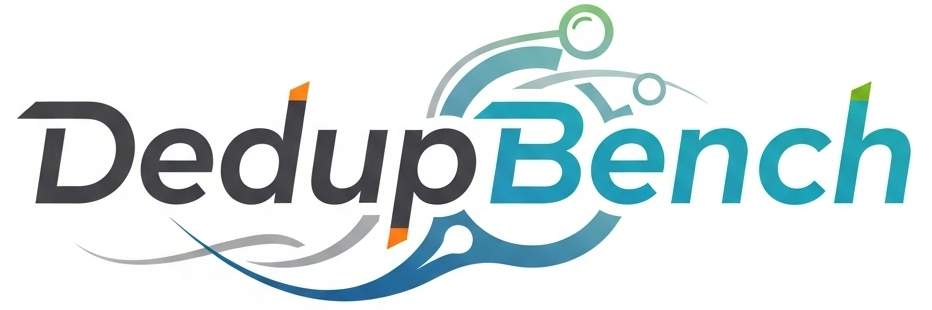

<h2><p align="center">Benchmarking Chunking Techniques for Data Deduplication</p></h2>

<h3><p align="center"> 
  <a href="#-quick-start-guide"> 🚀 Quick Start</a> | <a href="#news">⭐News</a> | <a href="#-research-papers"> 🔖 Cite us </a> | <a href="https://www.kaggle.com/datasets/sreeharshau/vm-deb-fast25"> 💾 VM Images Dataset </a> | <a href="#faq">❓FAQ </a> | <a href="#️-people"> 💂‍♂️ People </a>
</p></h3>

[](https://github.com/UWASL/dedup-bench/actions/workflows/makefile.yml)

# 🎉 Introduction

DedupBench is a benchmarking tool for data chunking techniques used in data deduplication. It is designed for extensibility, allowing new chunking and fingerprinting techniques to be implemented with minimal additional code. DedupBench is designed to be used with any dataset, allowing for the quick comparison of a large number of chunking techniques on user-specified data. 

It currently supports eleven different chunking algorithms and six different fingerprinting algorithms. It supports SIMD acceleration with [VectorCDC](https://www.usenix.org/conference/fast25/presentation/udayashankar) for these algorithms using five different vector instruction sets on Intel, AMD, ARM, and IBM CPUs. 

The following chunking techniques and vector instruction sets are currently supported by DedupBench.

| CDC Algorithm | Link | Unaccelerated | SSE-128 | AVX-256 | AVX-512 | NEON-128 (ARM) | VSX-128 (IBM) |
| :-------: | :-------: | :-------: | :-------: | :-------: | :-------: | :-------: | :-------: |
| AE-Max | [Paper](https://ieeexplore.ieee.org/document/7218510) | ✔️ | ✔️ | ✔️ | ✔️ | ✔️ | ✔️ |
| AE-Min | [Paper](https://ieeexplore.ieee.org/document/7218510) | ✔️ | ✔️ | ✔️ | ✔️ | ✔️ | ✔️ |
| CRC-32 | [Paper](https://dl.acm.org/doi/10.1145/3319647.3325834) | ✔️ | - | - | - | - | - |
| FastCDC | [Paper](https://www.usenix.org/conference/atc16/technical-sessions/presentation/xia) | ✔️ | - | - | - | - | - |
| Fixed-size | [Paper](https://www.usenix.org/conference/fast-02/venti-new-approach-archival-data-storage) |  ✔️ | - | - | - | - | - |
| Gear | [Paper](https://dl.acm.org/doi/10.1145/3319647.3325834) | ✔️ | - | - | - | - | - |
| MAXP| [Paper](https://www.sciencedirect.com/science/article/pii/S0022000009000580) | ✔️ | ✔️ | ✔️ | ✔️ | ✔️ | ✔️ |
| Rabin | [Paper](https://dl.acm.org/doi/abs/10.1145/502034.502052) | ✔️ | - | - | - | - | - |
| RAM | [Paper](https://www.sciencedirect.com/science/article/abs/pii/S0167739X16305829) | ✔️ | ✔️ | ✔️ | ✔️ | ✔️ | ✔️ |
| SeqCDC | [Paper](https://dl.acm.org/doi/10.1145/3652892.3700766) | ✔️ | - | - | - | - | - |
| TTTD | [Paper](https://shiftleft.com/mirrors/www.hpl.hp.com/techreports/2005/HPL-2005-30R1.pdf) | ✔️ | - | - | - | - | - |

# ⭐News
- *Aug. 2025*: We have released DedupBench v2.0 with ARM / IBM vector acceleration support, xxHash compatibility and much more!
- *Feb. 2025*:  VectorCDC has been published in [FAST](https://www.usenix.org/conference/fast25/presentation/udayashankar)!
- *Jan. 2025*: We have released the [DEB dataset](https://www.kaggle.com/datasets/sreeharshau/vm-deb-fast25) on Kaggle.


# 🚀 Quick start guide
To quickly get started, run the following commands on Ubuntu:

1. Clone repository and choose a basic build without SIMD acceleration.
```
  git clone git@github.com:UWASL/dedup-bench.git
  cd dedup-bench/
  sh ./install.sh
```
  

3. Run a preconfigured run with 8KB average chunk sizes and unaccelerated algorithms.
```
    cd build/
    ./dedup_script.sh -c unaccelerated_8kb random_dataset
    python3 plot_results.py results.txt
```

This should generate graphs titled _results_graph.png_ similar to the one below. Note that the space savings will be zero for all algorithms, as the default run uses the random dataset. 

To see a real dataset in action and generate the graph below, download and use the _DEB_ dataset used in our Middleware 2024 / FAST 2025 papers from [💾 VM Images Dataset](https://www.kaggle.com/datasets/sreeharshau/vm-deb-fast25). This graph is from an AMD EPYC Rome machine.


# ⚡ DedupBench SIMD Builds

To use any of the vector-accelerated CDC algorithms, an alternative Dedupbench build is required. Choose the right SIMD build when running `install.sh` or use the manual commands below. We have provided preconfigured files for all algorithms with 8KB chunk sizes for convenience.

**_Note that building with the wrong options (such as AVX-256 on a machine without AVX-256 support) may result in compile / runtime errors._**

### 🔥 SSE/AVX-256 Acceleration 
This build needs an AVX-256 compatible CPU to work correctly.
   ```
     cd build/
     make clean
     make simd_all

     ./dedup_script.sh -c simd_8kb random_dataset
     python3 plot_results.py results.txt
   ```
### 🌀 AVX-512 Acceleration
This build needs an AVX-512 compatible CPU to work correctly.
   ```
     cd build/
     make clean
     make simd512_all

     ./dedup_script.sh -c simd512_8kb random_dataset
     python3 plot_results.py results.txt
   ```

## 🚴 Basic Unaccelerated Build
This unaccelerated build should work on all machines regardless of CPU capabilities.
```
 cd build/
 make clean
 make

 ./dedup_script.sh -c unaccelerated_8kb random_dataset
 python3 plot_results.py results.txt
 ```

 ## 🔨 Alternate builds for ARM / IBM
 Note that we have not provided configuration file examples for these. Please refer to the custom runs section in the [❓FAQ](#faq).
 #### ARM with NEON-128 instructions
 ```
  cd build/
  make clean
  make arm_neon128
 ```
#### IBM with VSX-128 / AltiVec instructions
```
  cd build/
  make clean
  make ibm_altivec128
```

# 🔖 Research Papers

Please cite the relevant publications from this list if you use the code from this repository:

### Vectorized algorithms / DEB dataset
```
  [1] Udayashankar, S., Baba, A., & Al-Kiswany, S. (2025). VectorCDC: Accelerating Data Deduplication with Vector Instructions. In 23rd USENIX Conference on File and Storage Technologies (FAST 25) (pp. 513-522).
  [2] Udayashankar, S., Baba, A., Al-Kiswany, S. (2025). Accelerating Data Chunking in Deduplication Systems using Vector Instructions. arXiv preprint arXiv:2508.05797.
```
### SeqCDC
  ```
  [2] Udayashankar, S., Baba, A., & Al-Kiswany, S. (2024, December). Seqcdc: Hashless content-defined chunking for data deduplication. In Proceedings of the 25th International Middleware Conference (pp. 292-298).
  ```
### Low Entropy Analysis
  ```
  [3] Jarah, MA., Udayashankar, S., Baba, A., & Al-Kiswany, S. (2024, July). The impact of low-entropy on chunking techniques for data deduplication. In 2024 IEEE 17th International Conference on Cloud Computing (CLOUD) (pp. 134-140). IEEE.
  ```
  ### DedupBench Original Paper
  ```
  [4] Liu, A., Baba, A., Udayashankar, S., & Al-Kiswany, S. (2023, September). Dedupbench: A benchmarking tool for data chunking techniques. In 2023 IEEE Canadian Conference on Electrical and Computer Engineering (CCECE) (pp. 469-474). IEEE.
```

# 💂‍♂️ People

For additional information, contact us via email:
- Sreeharsha Udayashankar: s2udayas@uwaterloo.ca 
- Abdelrahman Baba: ababa@uwaterloo.ca 
- Mu'men Al-Jarah: mzaljara@uwaterloo.ca
- Samer Al-Kiswany: alkiswany@uwaterloo.ca 

# ❓FAQ

## How do I run the experiments from your Paper X?
We provide configuration files in `build/` for the experiments from our papers. You can use `dedup_script` with the correct configuration.
```
  ./dedup_script.sh -c 8kb_fast25 <path-to-dataset>
  python3 plot_results.py results.txt
```


## How do I run custom techniques / chunk sizes?
1. Choose the required chunking, hashing techniques, and chunk sizes by modifying `config.txt`. 
   ```
     cd build/
     vim config.txt
   ```
2. Run the dedup-bench binary directly. Note that the path to be passed is a **directory containing all the dataset files** and that the output is generated in a file `hash.out`. Throughput and avg chunk size are printed to stdout.
   ```
     ./dedup.exe <path_to_random_dataset_dir> config.txt
   ```
3. Measure space savings. Note that space savings will be zero if the random dataset is used.
   ```
     ./measure-dedup.exe hash.out
   ```

## How do I modify config.txt for custom runs?

### Chunking techniques (CDC algorithms)

Note that the `chunking_algo` parameter in the configuration file needs to be edited to switch CDC techniques.

| Chunking Technique | chunking_algo |
|--------------------|---------------|
| AE                 | ae            |
| CRC32                | crc            |
| FastCDC            | fastcdc       |
| Gear Chunking      | gear          |
| Rabin's Chunking   | rabins        |
| RAM                | ram           |
| SeqCDC             | seq           |
| TTTD               | tttd          |

After choosing a `chunking_algo`, make sure to check and adjust its parameters (e.g. chunk sizes). _Note that each `chunking_algo` has a separate parameter section in the config file_. For example, SeqCDC's minimum and maximum chunk sizes are called `seq_min_block_size` and `seq_max_block_size` respectively.

### SSE / AVX Acceleration
To change the SIMD acceleration used, change  `simd_mode` to one of the following values:
| SIMD Mode | simd_mode |
|-----------|-----------|
| SSE128    | sse128    |
| AVX256    | avx256    |
| AVX512    | avx512    |
| ARM NEON  | neon128   |
| IBM VSX   | altivec128 |

Note that only RAM, AE, and MAXP currently support SSE/AVX acceleration. dedup-bench must be compiled with AVX-512 support to use the `avx512` mode.

### Hashing Techniques
The following hashing techniques are currently supported by DedupBench. Note that the `hashing_algo` parameter in the configuration file needs to be edited to switch techniques.

| Hashing Technique | hashing_algo |
|-------------------|--------------|
| MD5               | md5          |
| SHA1              | sha1         |
| SHA256            | sha256       |
| SHA512            | sha512       |
| MurmurHash3 (128-bit) | murmurhash3 |
| xxHash3 (128-bit) | xxhash128       |  

# Where is the VM Dataset used in the DedupBench 2023 paper?

Note that this is **not the same** as the [💾 VM Images Dataset](https://www.kaggle.com/datasets/sreeharshau/vm-deb-fast25), but is a subset of it. The following images from Bitnami were used in the original DedupBench paper at CCECE 2023:

### Image URLs
```
  https://marketplace.cloud.vmware.com/services/details/tomcatstack?slug=true
  https://marketplace.cloud.vmware.com/services/details/mysql?slug=true
  https://marketplace.cloud.vmware.com/services/details/rubystack?slug=true
  https://marketplace.cloud.vmware.com/services/details/jenkins?slug=true
  https://marketplace.cloud.vmware.com/services/details/ejbca-singlevm?slug=true
  https://marketplace.cloud.vmware.com/services/details/kafka?slug=true
  https://marketplace.cloud.vmware.com/services/details/elasticsearch?slug=true
  https://marketplace.cloud.vmware.com/services/details/airflow-singlevm?slug=true
  https://marketplace.cloud.vmware.com/services/details/opencart?slug=true
  https://marketplace.cloud.vmware.com/services/details/grafana?slug=true
  https://marketplace.cloud.vmware.com/services/details/redis?slug=true
```

Note that the following images were also used in the paper but are unavailable as of Sept 2024.
```
  https://marketplace.cloud.vmware.com/services/details/phplist?slug=true
  https://marketplace.cloud.vmware.com/services/details/seopanel?slug=true
  https://marketplace.cloud.vmware.com/services/details/publify?slug=true
  https://marketplace.cloud.vmware.com/services/details/canvaslms?slug=true
```

# How do I figure out the right parameter values for SeqCDC?

We have added a detailed parameter search procedure to `supporting_tools/seqcdc-parameter-search/README.md`. Related scripts can be found in the same directory.

