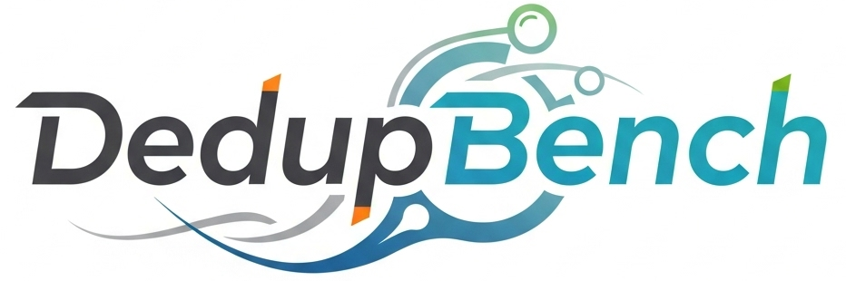

<h2><p align="center">Benchmarking Chunking Techniques for Data Deduplication</p></h2>

# 🎉 Introduction

DedupBench is a benchmarking tool for data chunking techniques used in data deduplication. It is designed for extensibility, allowing new chunking and fingerprinting techniques to be implemented with minimal additional code. DedupBench is designed to be used with any dataset, allowing for the quick comparison of a large number of chunking techniques on user-specified data. 

It currently supports eleven different chunking algorithms and six different fingerprinting algorithms. It supports SIMD acceleration with [VectorCDC](https://www.usenix.org/conference/fast25/presentation/udayashankar) for these algorithms using five different vector instruction sets on Intel, AMD, ARM, and IBM CPUs. 

The following chunking techniques and vector instruction sets are currently supported by DedupBench.

| CDC Algorithm | Link | Unaccelerated | SSE-128 | AVX-256 | AVX-512 | NEON-128 (ARM) | VSX-128 (IBM) |
| :-------: | :-------: | :-------: | :-------: | :-------: | :-------: | :-------: | :-------: |
| AE-Max | [Paper](https://ieeexplore.ieee.org/document/7218510) | ✔️ | ✔️ | ✔️ | ✔️ | ✔️ | ✔️ |
| AE-Min | [Paper](https://ieeexplore.ieee.org/document/7218510) | ✔️ | ✔️ | ✔️ | ✔️ | ✔️ | ✔️ |
| CRC-32 | [Paper](https://dl.acm.org/doi/10.1145/3319647.3325834) | ✔️ | - | - | - | - | - |
| FastCDC | [Paper](https://www.usenix.org/conference/atc16/technical-sessions/presentation/xia) | ✔️ | - | - | - | - | - |
| Fixed-size | [Paper](https://www.usenix.org/conference/fast-02/venti-new-approach-archival-data-storage) |  ✔️ | - | - | - | - | - |
| Gear | [Paper](https://dl.acm.org/doi/10.1145/3319647.3325834) | ✔️ | - | - | - | - | - |
| MAXP| [Paper](https://www.sciencedirect.com/science/article/pii/S0022000009000580) | ✔️ | ✔️ | ✔️ | ✔️ | ✔️ | ✔️ |
| Rabin | [Paper](https://dl.acm.org/doi/abs/10.1145/502034.502052) | ✔️ | - | - | - | - | - |
| RAM | [Paper](https://www.sciencedirect.com/science/article/abs/pii/S0167739X16305829) | ✔️ | ✔️ | ✔️ | ✔️ | ✔️ | ✔️ |
| SeqCDC | [Paper](https://dl.acm.org/doi/10.1145/3652892.3700766) | ✔️ | - | - | - | - | - |
| TTTD | [Paper](https://shiftleft.com/mirrors/www.hpl.hp.com/techreports/2005/HPL-2005-30R1.pdf) | ✔️ | - | - | - | - | - |


# 🚀 Artifact Evaluation - FAST 27

Note that WideCDC builds need a CPU with AVX-512 capabilities. We have tested our code on an Intel Skylake CPU (_c220g5_ from CloudLab Wisconsin) and an Intel Emerald Rapids CPU (_c6620_ from CloudLab Utah).

To get started, run the following commands on Ubuntu:

1. Clone repository and choose a build with AVX-512 acceleration.
```
  git clone git@github.com:UWASL/dedup-bench.git
  cd dedup-bench/
  sh ./install.sh
```
  
3. Run a preconfigured run with 8KB average chunk sizes and WideCDC + unaccelerated algorithms on a random dataset.
```
    cd build/
    ./dedup_script.sh -c 8kb_fast27 random_dataset
    python3 plot_results.py results.txt
```

This should generate graphs titled _results_graph.png_ similar to the one below. Note that the space savings will be zero for all algorithms, as this run uses the random dataset. 

4. To see a real dataset in action, download and use our publicly hosted _DEB_ dataset from [💾 VM Images Dataset](https://www.kaggle.com/datasets/sreeharshau/vm-deb-fast25). 
```
    cd build/
    ./dedup_script.sh -c 8kb_fast27 <path-to-downloaded-dataset>
    python3 plot_results.py results.txt
```

